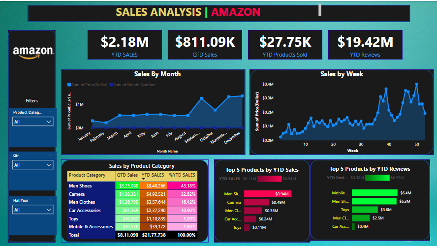
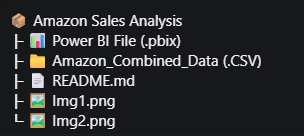

# Amazon-Sales-Dashboard

# 📊 Amazon Sales Analysis Dashboard

This Power BI dashboard provides a detailed analysis of Amazon's sales performance, offering insights into year-to-date (YTD) and quarter-to-date (QTD) metrics across various product categories.

---

## 📈 Key Highlights:

- **YTD Sales**: $2.18M  
- **QTD Sales**: $811.09K  
- **YTD Products Sold**: 27.75K  
- **YTD Reviews**: 19.42M  

The dashboard also provides visualizations for:
- **Sales by Month**
- **Sales by Week**
- **Sales by Product Category**
- **Top 5 Products by YTD Sales**
- **Top 5 Products by YTD Reviews**

---

## 🧾 Data Model Overview

The dashboard is built using two main tables:

### `Amazon_Data`
Contains all transactional and product-level information:
- `Order Date`
- `Price(Dollar)`
- `Product Category`
- `QTD Sales`
- `YTD SALES`
- `YTD Reviews`
- `YTD Products Sold`
- `Shipment`, etc.

### `Date`
Date dimension used for filtering and aggregating:
- `Month Name`
- `Month Number`
- `Qtr`
- `Quarter Number`
- `HalfYear`
- `Week`

---

## 🖼️ Dashboard Preview

---

## 📁 Folder Structure

---

## 💡 Notes

- Developed using **Power BI Desktop**
- Data is filtered dynamically by product category, quarter, and half-year
- Ideal for business users and analysts seeking to monitor performance and make informed decisions

---

## 🧠 Future Enhancements

- Add drill-throughs for individual product insights
- Integrate with real-time data source (e.g., AWS, Azure)
- Export reports to PDF for business sharing

